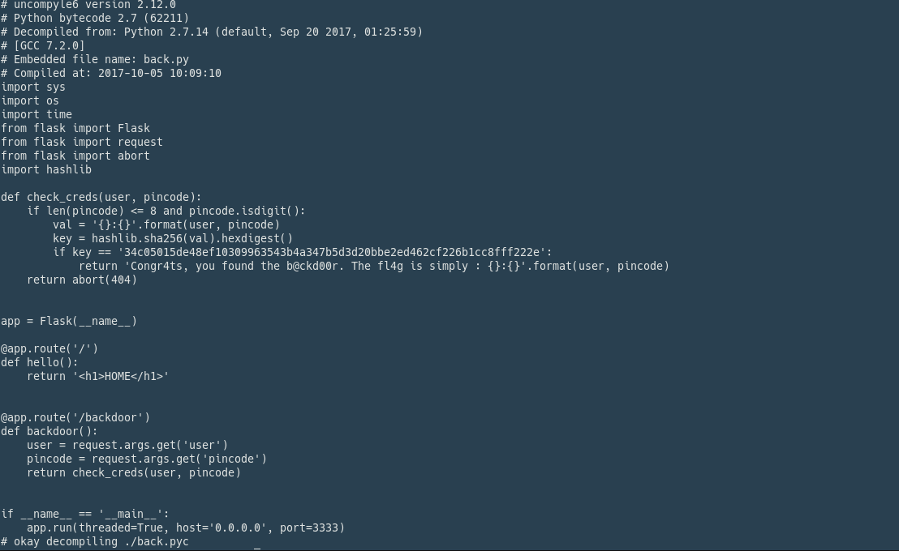

### BackdoorPi - 300

Task:

_We are doing an project for a school competition in which we need to use a Raspberry Pi to make an IOT prototype. We received SD cards from the professor, and because we lost ours we asked another group to give us a copy of their card, I know it’s been modified because the original hash doesn’t match. Could you please investigate and tell me if everything is ok? Here is some parts of the file system:_

_FLAG FORMAT: KLCTF{flag}_

*download this file: https://s3.eu-central-1.amazonaws.com/klctf/fs.zip*

We start by analyzing part of the file system, we find a cron job that execute the file /bin/back at startup, this is a [.pyc](../writeups/kaspersky/backdoor/back.pyc) file that we can translate to regular python with [uncompyle](https://github.com/rocky/python-uncompyle6)

Result:


Here we can see an interesting function
```python
def check_creds(user, pincode):
    if len(pincode) <= 8 and pincode.isdigit():
        val = '{}:{}'.format(user, pincode)
        key = hashlib.sha256(val).hexdigest()
        if key == '34c05015de48ef10309963543b4a347b5d3d20bbe2ed462cf226b1cc8fff222e':
            return 'Congr4ts, you found the b@ckd00r. The fl4g is simply : {}:{}'.format(user, pincode)
    return abort(404)
```
so we just have to find the user and the pincode, if we dig a bit further in the fs we find in /etc/group the user *b4ckd00r_us3r* now we can write a simple python script to bruteforce the pin.
(__I wrongly assumed that the pin length had to be exactly 8 where it clearly had to be between 1 and 8 digits__ luckly the pin was exactly 8 numbers.)

```python
import hashlib
i = 10000000
while i < 99999999:
    val = '{}:{}'.format('b4ckd00r_us3r', i)
    print val
    key = hashlib.sha256(val).hexdigest()
    if key == '34c05015de48ef10309963543b4a347b5d3d20bbe2ed462cf226b1cc8fff222e':
        print 'The flag is : {}:{}'.format('b4ckd00r_us3r', i)
        break
    i+=1
```
