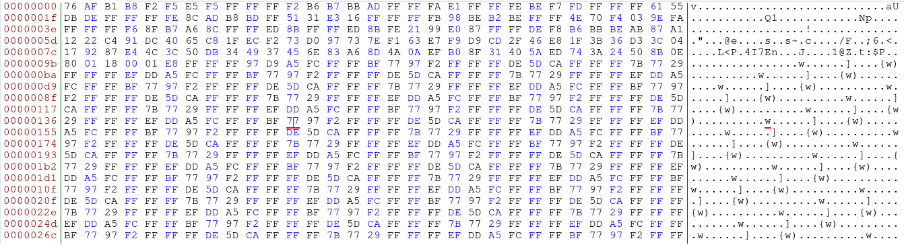
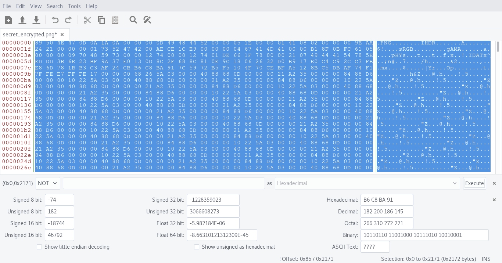

### [Kaspersky CTF] Security Home Cameras - 300

Challenge task:

_The smart home system has the function of remote monitoring of what is happening in the home and every few minutes sends pictures of the surveillance cameras to the owner of the house. You successfully intercepted the network traffic of this system, however, its creators took care of the security of their users data and encrypted the pictures. Decrypt the provided image and you will find the flag._

[secret_encrypted.png](./writeups/kaspersky/secret/secret_encrypted.png)

We start by opening the crypted image and look at something that could make sense, the first thing that we notice is a lot on, 0xFF the simplest operation that we can think is to do a bitwise NOT, you can either do that with a simple python script or directly in bless hex editor.

Crypted:

Decrypted:

So now we can save the file and have the flag!

[solved.png](./writeups/kaspersky/secret/solved1.png)
